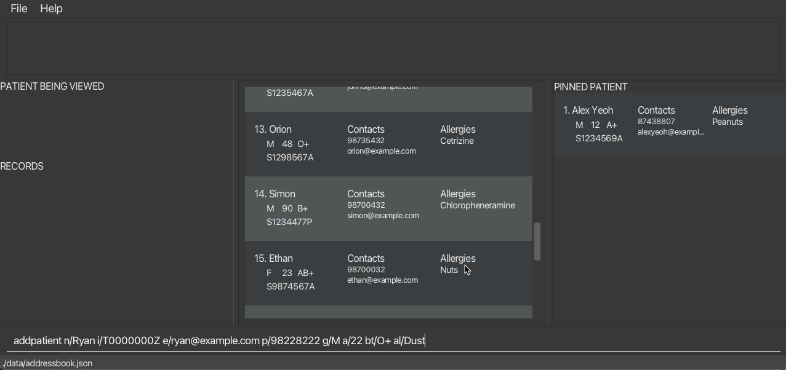
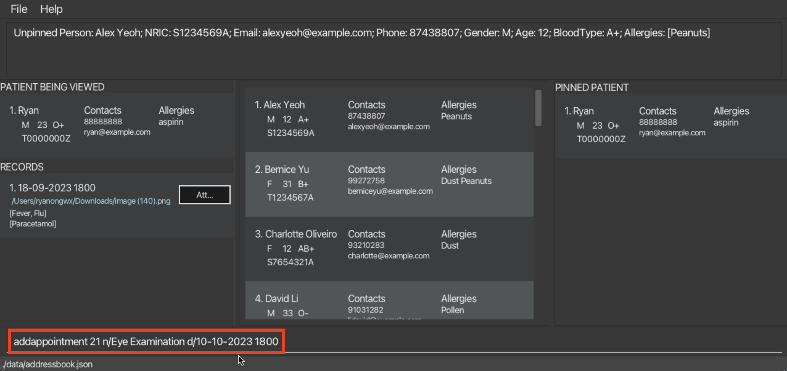
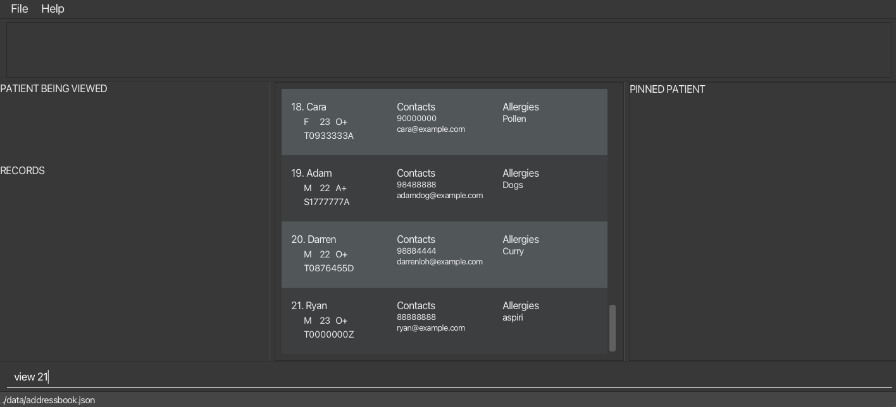
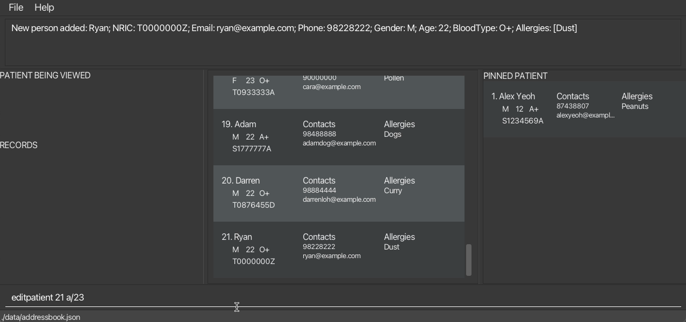
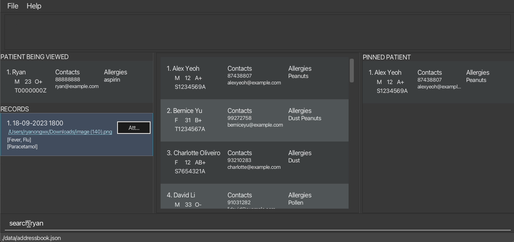
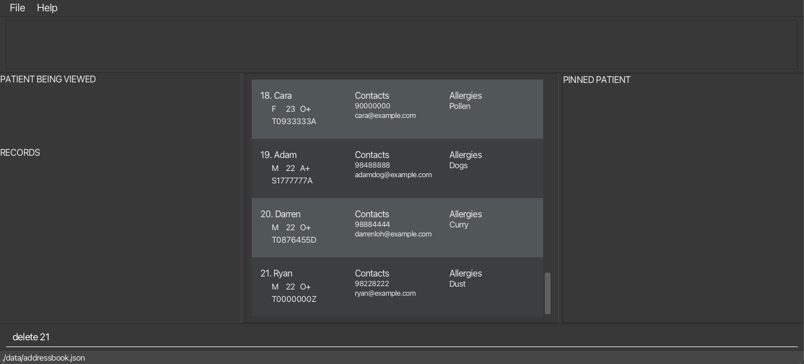
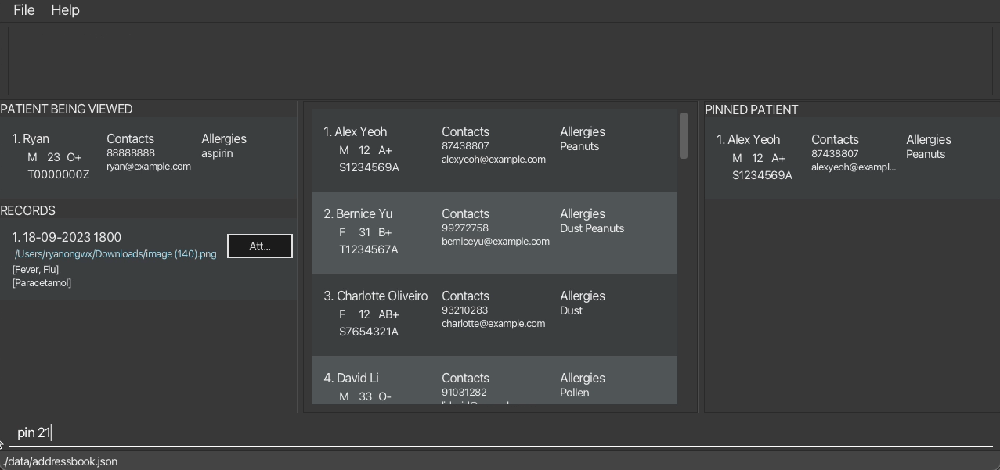

# User Guide

## Streamline Patient Management and Medical Records with Efficiently and Effectively!

MedBook is a **deskTable Of Contents application** crafted specifically for **doctors** and **medical administrative assistants** of **private clinics** to manage patient details and medical records.

MedBook provides a streamlined and user-friendly interface that ensures all vital data is well-organized, readily accessible, and securely maintained for your peace of mind.

Here's how MedBook can streamline your tasks:

- Quickly add, edit, remove and save patient details.
- Effortlessly handle patient appointments and records.
- Instantly find the information you need in a snap.
- Get a comprehensive view of patient data, medical records, and appointments at a glance.

Discover the power of MedBook:

- **Digitalize Your Clinic**: Effortlessly transition to a digitalized clinic enviornment with our user-friendly features.
- **Optimized for Speed**: MedBook offers both a **Command Line Interface (CLI)** and an intuitive **Graphical User Interface (GUI)**, making it ideal for fast typists like you.
- **QuickStart**: New to MedBook? Click [here](#quick-start) to start your journey.

---

## Table of contents

<!-- * Table of Contents -->
<page-nav-print />

---

## How to Navigate the User Guide

Welcome to the MedBook User Guide! Our goal is to empower you with the knowledge and confidence to make the most of MedBook's features.

- **Effortless Navigation**: Use the table of contents for seamless navigation between sections.
- **Quick Start for New Users**: If you're new to MedBook, start with the [Quick Start](#quick-start) section to get up and running.
- **Explore Features**: For those who have already set up MedBook, dive into the [Features](#features) section to discover all that our application has to offer.

We're here to make your experience as user-friendly as possible. Let's get started!

<u>[Back to Table Of Contents](#table-of-contents)</u>

## Quick start

1. Ensure you have Java `11` or above installed in your Computer.

   - [How do I check my version of Java?](#faq)

2. Download the latest jar file (`medbook.jar`) from our [github release](https://github.com/AY2324S1-CS2103T-T12-4/tp/releases).

3. Move the jar file to the folder which you want to store the data of your patients in.

   - Create a folder with your preferred name (you can call it MedBook) where you would like to house the application.
   - Move the downloaded jar file to the folder as shown below.
     - For Mac users:
     - For Windows users:

4. Open Terminal

- **On Windows**:

  - **Open Terminal**: Search for "Terminal" in the Windows search bar and open it.

- **On Mac**:
  - **Open Terminal**: You can find **Terminal** in the "Utilities" folder within the "Applications" folder. Or, you can use Spotlight Search by pressing Command + Spacebar and typing "Terminal".

1. Run MedBook application
   - Navigate to the folder where you have stored the jar file using the `cd` command
     <box type="tip" seamless>
     Tip: You can also right-click the folder housing the MedBook application and click on the `New Terminal at Folder` button (for **Mac** users), or the `Open in Terminal` button(for **Windows** users) to instantly navigate to the folder in your **Terminal**!
     </box>
   - Enter `java -jar medbook.jar` and press Enter. This command will open the application. 

The application should open up similar to the image below.

- Learn more about navigating the GUI [here](#navigating-the-graphical-user-interface-gui).
- For new users, learn how to use MedBook [here](#medBook-tutorial).
- For advanced users, view all the available features [here](#features).

<u>[Back to Table Of Contents](#table-of-contents)</u>

## Glossary

### Definitions

Here are some definitions of the terms used throughout this user guide.

| **Term**                       | **Definition**                                                                                                                                                                           |
| ------------------------------ | ---------------------------------------------------------------------------------------------------------------------------------------------------------------------------------------- |
| Graphical User Interface (GUI) | The GUI allows you to interact with the application through things you can click, instead of typing commands. It also provides visual display for information stored in the application. |
| Command Line Interface (CLI)   | The CLI is a way of interacting with the application using typed text commands.                                                                                                          |
| Command                        | A command is a textual input that users type into the command-line interface to interact with the application.                                                                           |
| Parameter                      | A parameter is a specific piece of information or data that you provide to a command in a command line interface to customize the command's action.                                      |

<u>[Back to Table Of Contents](#table-of-contents)</u>

## Navigating the GUI

Here is a brief summary of GUI component of the main window of MedBook.

| **Name of component** | **Description**                                                                                          |
| --------------------- | -------------------------------------------------------------------------------------------------------- |
| Menu Bar              | Displays the drop down menus for MedBook, such as **File** and **Help**                                  |
| Message Display Box   | Display the message output for every command. It can either can be an error or success message           |
| Patient Card          | Contains information of the patient such as name, age, and contact information                           |
| Patient List          | Displays a list of Patient Cards                                                                         |
| Patient Being Viewed  | The Patient Card of the patient currently being viewed                                                   |
| Record Card           | Contains information of the medical record including date and time, condition, and prescribed medication |
| Medical Records List  | Displays a list of Record Cards belonging to the Patient Being Viewed                                    |
| Pinned Patient List   | Displays a list of Patient Cards of pinned patients                                                      |
| Command Input Box     | A text box which allows users to input commands                                                          |

| **Name of component** | **Description**                                                                                                                                                                                      |
| --------------------- | ---------------------------------------------------------------------------------------------------------------------------------------------------------------------------------------------------- |
| Appointment Card      | Contains information of the appointment including name, date and time and NRIC                                                                                                                       |
| Appointment List      | Displays a list of Appointment Cards                                                                                                                                                                 |
| Calendar              | A calendar that displays appointments on their corresponding dates. Only a truncated `NAME` of the **first two** appointments according to the **Appointment List** will be displayed for each date. |
| Previous Button       | Shifts the calendar to the previous month                                                                                                                                                            |
| Next Button           | Shifts the calendar to the next month                                                                                                                                                                |

<u>[Back to Table Of Contents](#table-of-contents)</u>

## MedBook Tutorial

1. Launch the MedBook application. You may refer to [here](#quick-start).

   <box type="info" seamless>
     Info: On launch, MedBook will be populated with some sample data.
     </box>

2. Let us try opening the help window. Type `help` in the Command Input Box and press Enter.
   A help box containing a list of all commands, similar to the one below, should open up.  
   Please refer to the [Features](#features) section for a more detailed explanation of the commands.
3. Now, let us try adding a new patient. Type in `addpatient n/John Doe i/A0000000B e/johndoe@gmail.com p/12345678 g/M a/26 bt/AB+ al/Penicillin` and press Enter.
   A similar message output should be shown in the Message Display Box. 
4. Try adding a few more patient to MedBook by yourself!
5. Now, let us try adding a record to a patient. Type in `addrecord 3 d/18-09-2023 1800 c/Fever m/Paracetamol` and press Enter.
   This will create a new medical record to the third patient shown in the **Patient List**.
   A similar message output should be shown in the Message Display Box.  
6. Try adding a few more records to patients in the MedBook by yourself!
7. Let us view the medical records of the first patient. Type in `view 1` to see all the records of the first patient.
   If you haven't added any medical records to the first patient, a similar **Record List** should be shown.
    

You now have the necessary information required to start using MedBook. Try out the features in the following section on your own and explore the potential of MedBook!

<u>[Back to Table Of Contents](#table-of-contents)</u>

---

## Features

<box type="info" seamless>

**Notes about the command format:** 

- Words in `UPPER_CASE` are the parameters to be supplied by the user. 
  e.g. in `addpatient n/NAME`, `NAME` is a parameter which can be used as `add n/John Doe`.

- Items in square brackets are optional. 
  e.g `n/NAME [al/ALLERGIES]` can be used as `n/John Doe al/Pencillin` or as `n/John Doe`.

- Items with `…`​ after them can be used multiple times. 
  e.g. `[al/ALLERGIES]…​` can be used as ` ` (i.e. 0 times), `al/Pencillin`, `al/Pollen al/Dust` etc.

- Parameters can be in any order. 
  e.g. if the command specifies `n/NAME p/PHONE_NUMBER`, `p/PHONE_NUMBER n/NAME` is also acceptable.

- Extraneous parameters for commands that do not take in parameters (such as `help`, `list`, and `exit`) will be ignored. 
  e.g. if the command specifies `help 123`, it will be interpreted as `help`.

- `PATIENTID`: refers to the unique patient ID shown in the displayed **Patient List**. The ID **must be a positive integer** 1, 2, 3, …​  

- `RECORDID`: refers to the unique record ID shown in the displayed **Medical Record List** of a specific patient. The ID **must be a positive integer** 1, 2, 3, …​  

- `APPOINTMENTID`: refers to the unique appointment ID shown in the displayed **Appointment List**. The ID **must be a positive integer** 1, 2, 3, …​  

- `PINNEDID`: refers to the unique ID shown in the displayed **Pinned Patient List**. The ID **must be a positive integer** 1, 2, 3, …​  

</box>

### Parameters

| FIELD        | PREFIX | CONSTRAINTS                                                                                                   |
| ------------ | ------ | ------------------------------------------------------------------------------------------------------------- |
| `NAME`       | n      | Alphanumeric characters, dashes, dots and spaces only                                                         |
| `NRIC`       | i      | Starts with a letter, followed by seven digits, and ends with another letter (letters are not case-sensitive) |
| `EMAIL`      | e      | Must be of the format **local-part@domain**                                                                   |
| `GENDER`     | g      | Either **M** or **F**                                                                                         |
| `PHONE`      | p      | Must be at least 3 digits long                                                                                |
| `AGE`        | a      | Must be a non-negative integer                                                                                |
| `BLOODTYPE`  | bt     | Must be one of **A-**, **A+**, **B-**, **B+**, **AB-**, **AB+**, **O-**, **O+**                               |
| `ALLERGY`    | al     | Alphanumeric characters only                                                                                  |
| `DATETIME`   | d      | Must be of the format **dd-MM-yyyy HHmm**                                                                     |
| `CONDITION`  | c      | Alphanumeric characters, dashes and spaces only                                                               |
| `MEDICATION` | m      | Alphanumeric characters, dashes and spaces only                                                               |

<box type="info" seamless>

**Notes for `EMAIL` format:**  

1. The **local-part** should only contain alphanumeric characters and these special characters: `+`, `\`, `_`, `.`, `-`. The **local-part** may not start or end with any special characters.  

2. This is followed by an `@` and then a **domain** name. The **domain** name is made up of **domain** labels separated by periods.  

The **domain** name must:  

- end with a **domain** label at least 2 characters long  

- have each **domain** label start and end with alphanumeric characters  

- have each **domain** label consist of alphanumeric characters, separated only by hyphens, if any.
  </box>

  <box type="info" seamless>

**Notes for `NRIC` format:**  

- If the patient's name contains the `/` character, use the `-` character instead. For example, use `s-o` instead of `s/o`.
  </box>

  <box type="info" seamless>

**Notes for email format:**  

- If the patient does not have an NRIC, eg. foreigners, a placeholder NRIC which is not valid such as `A1234567A` can be used instead.
  </box>

1. When noting down allergies that consist of multiple words, they should be consolidated into a single word with each word's initial letter capitalized.  
   **Example:** Red Meat should be written as RedMeat.

</box>

<u>[Back to Table Of Contents](#table-of-contents)</u>

### Viewing help : `help`

Opens/focuses the **Help Window** displaying all the commands.

Format: `help`

<u>[Back to Table Of Contents](#table-of-contents)</u>

### Adding a patient: `addpatient`

Adds a patient.

Format: `addpatient n/NAME i/NRIC e/EMAIL p/PHONE g/GENDER a/AGE bt/BLOODTYPE [al/ALLERGY]...`

- Adds a patient with information including: `NAME`, `NRIC`, `EMAIL`, `GENDER`, `PHONE`, `AGE`, `BLOODTYPE`, `ALLERGY`.

Example:

`addpatient n/John Doe i/T1234567A e/johndoe@gmail.com p/12345678 g/M a/26 bt/AB+ al/Penicillin`
Adds a **Male** patient named **John Doe** whose NRIC is **T1234567A** , **26** years old, has **AB+** Blood Type, and is allergic to **Penicillin**.
His email and phone number is **johndoe@gmail.com** and **12345678**, respectively.

<box type="info" seamless>
Info:
If the patient does not have an NRIC, eg. foreigners, a placeholder NRIC which is not valid such as `A1234567A` can be used.
If the patient's name contains the "/" character, use the "-" character instead. For example, use "s-o" instead of "s/o".
</box>

Screenshots:

<u>[Back to Table Of Contents](#table-of-contents)</u>

### Adding Medical Records : `addrecord`

Adds a medical record to a patient.

Format: `addrecord PATIENTID d/DATETIME c/CONDITIONS... m/MEDICATIONS...`

- Adds a medical record to the patient with the corresponding `PATIENTID`.  

- Duplicate entries for `CONDITIONS` and `MEDICATIONS` are allowed and will be considered as separate entries.
  - `addrecord 1 d/10-11-2023 1800 c/Flu c/Flu m/Ibuprofen m/Ibuprofen` will store **[Flu, Flu]** and **[Ibuprofen, Ibuprofen]** for `CONDITIONS` and `MEDICATIONS`, respectively.

Example:

- `addrecord 3 d/18-09-2023 1800 c/Fever m/Paracetamol`
  Adds a medical record to the patient with the `PATIENTID` of **3**.
  The patient visited the clinic on **September 18th, 2023** at **6:00PM** with a **Fever** and was prescribed **Paracetamol**.

Screenshots:

<u>[Back to Table Of Contents](#table-of-contents)</u>

### Adding an Appointment : `addappointment`

Adds an appointment.

Format: `addappointment PATIENTID n/NAME d/DATETIME`

- Adds an appointment to the patient with the corresponding `PATIENTID`.

Example:

- `addappointment 2 n/Eye Examination d/10-10-2023 1800` Adds an `Eye Examination` to the patient with the `PATIENTID` of **2**. The appointment is schedueld for the **10th of October 2023** at **6:00PM**.

Screenshots:

<u>[Back to Table Of Contents](#table-of-contents)</u>

### View patient records : `view`

Displays the medical records of the specified patient.

Format: `view PATIENTID`

- The medical records of the patient with the corresponding `PATIENTID` will be displayed on screen in the **Medical Record List**.  

- The corresponding patient's **Patient Card** will be displayed in the **Patient Being Viewed** section.  

Examples:

- `view 2` displays the medical records of the patient with the `PATIENTID` of **2**. The records will be displayed in the **Medical Record List** and patient information will be in the **Patient Being Viewed** section.

<box type="info" seamless>
    The PATIENTID in the Patient Being Viewed section will display **1**. If you wish to perform commands on the patient, use the PATIENTID displayed in the Patient List.
</box>

Screenshots:

<u>[Back to Table Of Contents](#table-of-contents)</u>

### View appointments : `viewappointment`

Opens/focuses the **Appointment Window** displaying all the appointments.

Format: `viewappointment`

<u>[Back to Table Of Contents](#table-of-contents)</u>

### Editing details of a patient : `editpatient`

Edits the details of an existing patient

Format: `editpatient PATIENTID PREFIX/NEWVALUE...`

- Edits the details of the patient with the corresponding `PATIENTID`.  

- Acceptable fields: `NAME`, `EMAIL`, `PHONE`, `GENDER`, `AGE`, `BLOODTYPE`, `ALLERGY`.  
  <box type="info" seamless>
  **Note**: `NRIC` cannot be edited.
  </box>

- Existing values in the respective fields will be updated to the `NEWVALUE`.  

- Multiple entries of `ALLERGY` are allowed i.e `editpatient 1 al/Seafood al/Dust`.  
  <box type="info" seamless>
  **Note**: When editing `ALLERGY`, the existing allergies of the patient will be removed i.e adding of allergies is not cumulative.
  </box>

Examples:

- `editpatient 1 e/johndoe_updated@gmail.com` Edits the `EMAIL` of the patient with the `PATIENTID` of **1** to **johndoe_updated@gmail.com**.  

- `editpatient 2 p/92345678` Edits the `PHONE` of the patient with the `PATIENTID` of **2** to **92345678**.  

- `editpatient 3 al/aspirin` Edits the `ALLERGY` of the patient with the `PATIENTID` of **3** to**aspirin**.  

- `editpatient 2 p/92345678 al/aspirin` Edits the `PHONE` and `ALLERGY` of the patient with the `PATIENTID` of **2** to **92345678** and **aspirin**, respectively.  

Screenshots:

<u>[Back to Table Of Contents](#table-of-contents)</u>

### Editing a record of a patient : `editrecord`

Edits the details of an existing record

Format: `editrecord PATIENTID/RECORDID PREFIX/NEWVALUE...`

- Edits the details of the record with the corresponding `RECORDID` of the patient with the corresponding `PATIENTID`.  

- Acceptable fields : `DATETIME`, `CONDITION`, `MEDICATION`.  

- Existing values in the respective fields will be updated to the `NEWVALUE`.  

- Multiple entries of `CONDITION` and `MEDICATION` are allowed i.e `editrecord 1/1 c/Flu c/Fever m/Panadol m/Ibuprofen`.  

Examples:

- `editrecord 1/1 d/25-10-2023 1200` Edits the `DATETIME` of the record with the `RECORDID` of **1** of the patient with the `PATIENTID` of **1** to **25-10-2023 1200**.  

- `editrecord 1/1 c/Headache c/Flu` Edits the `CONDITION` of the record with the `RECORDID` of **1** of the patient with the `PATIENTID` of **1** to **Headache, Flu**.  

- `editrecord 1/1 c/Headache m/Paracetamol` Edits the `CONDITION` and `MEDICATION` of the record with the `RECORDID` of **1** of the patient with the `PATIENTID` of **1** to **Headache** and **Paracetamol**, respectively.  

<u>[Back to Table Of Contents](#table-of-contents)</u>

### Locating patients by keywords: `search`

Searches for patients with details containing the corresponding `KEYWORD`

Format: `search KEYWORD [MOREKEYWORDS]...`

- The search is not case-sensitive. e.g **Penicillin** will match **penicillin**.  

- The order of the keywords does not matter. e.g. **Hans Bo** will match **Bo Hans**.

- Patients matching at least one keyword will be returned. e.g. **Hans Bo** will return **Hans Gruber**, **Bo Yang**.  

- Patients with detail that are not exactly the same as the `KEYWORD` searched will not appear. e.g. **Han** will not return **Hans**.  

  <box type="info" seamless>
  **Note**: The details of the patient's medical records will not be searched.
  </box>

  Examples:

- `search Alex` Will display patients with **Alex** in their details.  

- `search Alex M` Will display patients with **Alex** or **M** in their details.

Screenshots:

<u>[Back to Table Of Contents](#table-of-contents)</u>

### Locating records by keywords: `searchrecord`

Searches for records of the Patient Being Viewed with details containing the corresponding `KEYWORD`

Format: `searchrecord KEYWORD [MOREKEYWORDS]...`

- The search is not case-sensitive. e.g **Penicillin** will match **penicillin**.  

- Records matching at least one **KEYWORD** will be returned. e.g. **Mild Fever** will return **Mild Flu**, **High Fever** 

- Records with detail that are not exactly the same as the **KEYWORD** searched will not appear. e.g. **Head** will not return **Headache**.  

  <box type="important" seamless>
  **Important**: The **Patient Being Viewed** section should not be empty. Otherwise `searchrecord` command will not return any records.
  </box>

Examples:

- `searchrecord Penicillin` Will display records of the Patient Being Viewed with **Penicillin** in their details.  

- `searchrecord Fever Cough` Will display records of the Patient Being Viewed with **Fever** or **Cough** in their details.  

- `searchrecord 19-10-2023` Will display records of the Patient Being Viewed with **19-10-2023** in their details.  

<u>[Back to Table Of Contents](#table-of-contents)</u>

### Listing all patients : `list`

Shows a list of all patients.

Format: `list`

- **All** patients will be shown in the **Patient List**.

<box type="info" seamless>
    The `list` command allows you to easily view all the patients in the **Patient List**. For instance, after you've used the `search` command to find specific patients, you can use the `list` command to gather all the patients conveniently!
</box>

<u>[Back to Table Of Contents](#table-of-contents)</u>

### Deleting a patient : `delete`

Deletes a patient.

Format: `delete PATIENTID`

- Deletes the patient with the corresponding `PATIENTID`.

Example:

- `delete 2` Deletes the patient with the `PATIENTID` of **2**.

Screenshots:

<u>[Back to Table Of Contents](#table-of-contents)</u>

### Deleting a record : `deleterecord`

Deletes a record from a patient.

Format: `deleterecord PATIENTID/RECORDID`

- Deletes the record with the corresponding `RECORDID` from the patient with the corresponding `PATIENTID`.

Example:

- `deleterecord 2/1` Deletes the record with the `RECORDID` of **2** from the patient with the `PATIENTID` of **1**.

<u>[Back to Table Of Contents](#table-of-contents)</u>

### Deleting an appointment : `deleteappointment`

Deletes an appointment.

Format: `deleteappointment APPOINTMENTID`

- Deletes the appointment with the corresponding `APPOINTMENTID`.

Example:

- `deleteappointment 1` Deletes the appointment with the `APPOINTMENTID` of **1**.

<u>[Back to Table Of Contents](#table-of-contents)</u>

### Pinning a Patient : `pin`

Pins a patient.

Format: `pin PATIENTID`

- Pins the patient with the corresponding `PATIENTID` to the **Pinned Patient List**.

Example:

- `pin 2` Pins the patient with the `PATIENTID` of **2** to the **Pinned Patient List**.

Screenshots:

<u>[Back to Table Of Contents](#table-of-contents)</u>

### Unpinning a Patient : `unpin`

Unpins a patient.

Format: `unpin PINNEDID`

- Unpins the patient with the corresponding `PINNEDID` from the **Pinned Patient List**.

Examples:

- `unpin 2` Unpins the patient with the `PINNEDID` of **2** from the **Pinned Patient List**.

<u>[Back to Table Of Contents](#table-of-contents)</u>

### Attaching files to a patient's record

Attach local files to a patient's record by clicking on the **Attach** button located within each **Record Card**.

<box type="warning" seamless>
Caution: Refrain from deleting/relocating the local file. If necessary, re-attach the new file after relocation/deletion.
</box>

Screenshots:

<u>[Back to Table Of Contents](#table-of-contents)</u>

### Exiting the program : `exit`

Exits the program.

Format: `exit`

<u>[Back to Table Of Contents](#table-of-contents)</u>

### Saving the data

MedBook data is saved in the `data` folder automatically after any command that changes the data. This ensures the safety of your data. When MedBook is restarted, the data is loaded back into the application automatically.

<u>[Back to Table Of Contents](#table-of-contents)</u>

### Editing the data file

MedBook data is saved automatically as a JSON file located in `[jar file location]/data/medbook.json`. The file can be edited directly to make changes to MedBook data.

<box type="warning" seamless>
Caution:
Only advanced users are encouraged to make changes to the data file as wrong data formatting may result in the application not working as intended.
</box>

<u>[Back to Table Of Contents](#table-of-contents)</u>

---

## FAQ

**Q**: How do I check my java version? 
**A**: Open a **Terminal** and enter `java -version`. If you do not have Java installed, you can download it [here](https://www.oracle.com/java/technologies/downloads/#java11).

**Q**: How do I transfer my data to another Computer? 
**A**: Install the app in the other computer and copy the `data` folder over to the folder of the installed jar file in the other computer.

<u>[Back to Table Of Contents](#table-of-contents)</u>

---

## Known issues

1. **When using multiple screens**, if you move the application to a secondary screen, and later switch to using only the primary screen, the GUI will open off-screen. The remedy is to delete the `preferences.json` file created by the application before running the application again.

<u>[Back to Table Of Contents](#table-of-contents)</u>

---

## Command Summary

| Action                 | Format, Examples                                                                                                                                                                                    |
| ---------------------- | --------------------------------------------------------------------------------------------------------------------------------------------------------------------------------------------------- |
| **Help**               | `help`                                                                                                                                                                                              |
| **Add Patient**        | `addpatient n/NAME i/NRIC e/EMAIL p/PHONE g/GENDER a/AGE bt/BLOODTYPE [al/ALLERGY]...​`   e.g., `addpatient n/John Doe i/T1234567A e/johndoe@gmail.com p/12345678 g/M a/26 bt/AB+ al/Penicillin` |
| **Add Record**         | `addrecord PATIENTID d/DATETIME c/CONDITION... m/MEDICATION...`  e.g., `addrecord 2 d/10-10-2020 1900 c/Fever m/Painkiller`                                                                      |
| **Add Appointment**    | `addappointment PATIENTID n/NAME d/DATETIME`  e.g., `addappointment 2 n/Eye Exam d/10-10-2020 1900`                                                                                              |
| **List**               | `list`                                                                                                                                                                                              |
| **View Records**       | `view PATIENTID`  e.g., `view 2`                                                                                                                                                                 |
| **View Appointments**  | `viewappointment`                                                                                                                                                                                   |
| **Edit Patient**       | `editpatient PATIENTID PREFIX/NEWVALUE...`  e.g.,`editpatient 1 e/johndoe_updated@gmail.com`                                                                                                     |
| **Edit Record**        | `editrecord PATIENTID/RECORDID PREFIX/NEWVALUE...`  e.g.,`editrecord 1/1 d/25-10-2023 1200`                                                                                                      |
| **Search Patients**    | `search KEYWORD [MOREKEYWORDS]...`  e.g., `search James`                                                                                                                                         |
| **Search Records**     | `searchrecord KEYWORD [MOREKEYWORDS]...`  e.g., `searchrecord Headache`                                                                                                                          |
| **Delete Patient**     | `delete PATIENTID`  e.g., `delete 3`                                                                                                                                                             |
| **Delete Record**      | `deleterecord PATIENTID/RECORDID`  e.g., `deleterecord 2/1`                                                                                                                                      |
| **Delete Appointment** | `deleteappointment APPOINTMENTID`  e.g., `deleteappointment 1`                                                                                                                                   |
| **Pin**                | `pin PATIENTID`  e.g., `pin 2`                                                                                                                                                                   |
| **Unpin**              | `unpin PINNEDID`  e.g. `unpin 2`                                                                                                                                                                 |
| **Exit**               | `exit`                                                                                                                                                                                              |

<u>[Back to Table Of Contents](#table-of-contents)</u>
