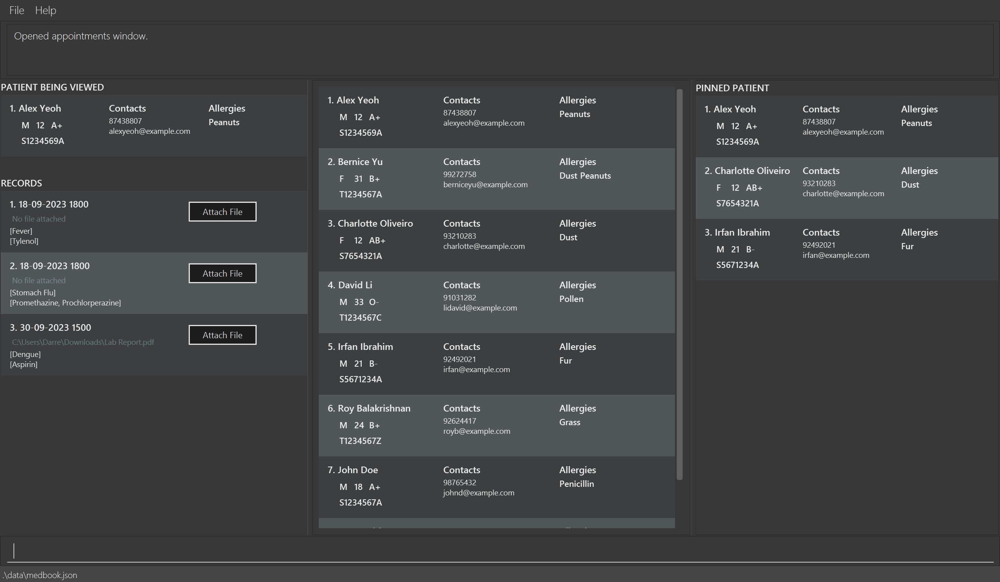

# MedBook User Guide

Medbook is a **desktop app for managing patient details and medical records, optimized for use via a  Line Interface** (CLI) while still having the benefits of a Graphical User Interface (GUI). If you can type fast, MedBook can get your contact management tasks done faster than traditional GUI apps.

<!-- * Table of Contents -->
<page-nav-print />

--------------------------------------------------------------------------------------------------------------------

## Quick start

1. Ensure you have Java `11` or above installed in your Computer.

1. Download the latest `medbook.jar` from [here](https://github.com/AY2324S1-CS2103T-T12-4/tp/releases).

1. Copy the file to the folder you want to use as the _home folder_ for your MedBook.

1. Open a command terminal, `cd` into the folder you put the jar file in, and use the `java -jar medbook.jar` command to run the application. 
   A GUI similar to the below should appear in a few seconds. Note how the app contains some sample data. 
   

1. Type the command in the command box and press Enter to execute it. e.g. typing **`help`** and pressing Enter will open the help window. 
   Some example commands you can try:

   * `list` : Lists all contacts.

   * `add n/John Doe p/98765432 e/johnd@example.com a/John street, block 123, #01-01` : Adds a contact named `John Doe` to the MedBook.

   * `delete 3` : Deletes the 3rd contact shown in the current list.

   * `clear` : Deletes all contacts.

   * `exit` : Exits the app.

1. Refer to the [Features](#features) below for details of each command.

--------------------------------------------------------------------------------------------------------------------

## Features

<box type="info" seamless>

**Notes about the command format:** 

* Words in `UPPER_CASE` are the parameters to be supplied by the user. 
  e.g. in `add n/NAME`, `NAME` is a parameter which can be used as `add n/John Doe`.

* Items in square brackets are optional. 
  e.g `n/NAME [t/TAG]` can be used as `n/John Doe t/friend` or as `n/John Doe`.

* Items with `…`​ after them can be used multiple times including zero times. 
  e.g. `[t/TAG]…​` can be used as ` ` (i.e. 0 times), `t/friend`, `t/friend t/family` etc.

* Parameters can be in any order. 
  e.g. if the command specifies `n/NAME p/PHONE_NUMBER`, `p/PHONE_NUMBER n/NAME` is also acceptable.

* Extraneous parameters for commands that do not take in parameters (such as `help`, `list`, `exit` and `clear`) will be ignored. 
  e.g. if the command specifies `help 123`, it will be interpreted as `help`.

* If you are using a PDF version of this document, be careful when copying and pasting commands that span multiple lines as space characters surrounding line-breaks may be omitted when copied over to the application.
</box>

### Viewing help : `help`

Shows a message explaning how to access the help page.

Format: `help`

### Adding a patient: `addpatient`

Adds a patient's contact and medical details.

Command Format: addpatient [name/email/phone/gender/age/blood type/allergies]

Examples:
* `addpatient John Doe/johndoe@gmail.com/12345678/M/26/AB+/Penicillin`

Expected Outputs on Success
* **GUI:** Contact details added to the respective patient's record.
* **Message:** Patient details added successfully.

Expected Output on Failure
* **Message:** Failed to add details. Please check the command format and try again.

### Adding Medical Records : 'addrecord'

Adds a new patient's medical records to the app.

Command Format: addrecord [id/date/condition(s)]

Examples:
* `addrecord 3/18-09-2023 1800/Fever`

Expected outputs on success:
* **GUI:** A new entry appearing in the patient list.
* **Messages:** "Patient record added successfully."

Expected outputs on failure:
* **Messages:** "Failed to add patient record. Please check the command format and try again."
* **Messages:** “Failed to add patient record. The patient does not exist”

### Listing all persons : `view`

Shows a list of all patients in the Medbook.

Format: `view`

### View patient detail

Shows the detailed information of the patient by clicking.

### Editing detail of a patient : `editdetail`

Edits an existing person in MedBook.

Format: `editdetail [patient ID/detail field/updated patient details]`
* Edits the person at the specified `patient ID`. The index refers to the index number shown in the displayed person list. The index **must be a positive integer** 1, 2, 3, …​
* The `detail field` must be provided.
* Accepted `detail field` : **name**, **email**, **phone**, **gender**, **age**, **blood**, **allergy**.
* Existing values in the `detail field` will be updated to the `updated patient details` input.
* **Name**: Text (up to 256 characters)
* **Email**: Valid email format
* **Phone**: Number (up to 15 digits)
* **Gender**: M/F
* **Age**: Number (0-120)
* **Blood Type**: One of [A+, A-, B+, B-, AB+, AB-, O+, O-]
* **Allergies**: Text (up to 512 characters)

Examples:
*  `editdetail 1/email/johndoe_updated@gmail.com` Edits the email address of the 1st person to be `johndoe_updated@gmail.com`.
*  `editdetail 2/phone/92345678` Edits the name of the 2nd person to be `92345678`.
*  `editdetail 3/allergy/aspirin` Edits the allergy of the 3rd person to be `aspirin`.

### Locating persons by name: `find`

Finds persons whose names contain any of the given keywords.

Format: `find KEYWORD [MORE_KEYWORDS]`

* The search is case-insensitive. e.g `hans` will match `Hans`
* The order of the keywords does not matter. e.g. `Hans Bo` will match `Bo Hans`
* Only the name is searched.
* Only full words will be matched e.g. `Han` will not match `Hans`
* Persons matching at least one keyword will be returned (i.e. `OR` search).
  e.g. `Hans Bo` will return `Hans Gruber`, `Bo Yang`

Examples:
* `find John` returns `john` and `John Doe`
* `find alex david` returns `Alex Yeoh`, `David Li` 
  

### Deleting a patient : `delete`

Deletes the specified patient from the medbook.

Format: `delete [patientId]`

* Deletes the patient at the specified `patientId`.
* The patientId refers to the unique patient id shown in the displayed patient list.
* The id **must be a positive integer** 1, 2, 3, …​

Examples:
* `delete 2` deletes the patient with the id of `2` in the medbook.

### Pinning a patient : `pin`

Pins the specified patient to the top of the patient list.

Format: `pin [patientId]`

* Pins the patient at the specified `patientId` to the top of the patient list.
* The pinned patient will always be visible on screen at the top of the patient list.
* The patientId refers to the unique patient id shown in the displayed patient list.
* The id **must be a positive integer** 1, 2, 3, …​

Examples:
* `pin 2` pin the patient with the id of `2` in the medbook to the top of the patient list.

### Clearing all entries : `clear`

Clears all entries from the medbook.

Format: `clear`

### Exiting the program : `exit`

Exits the program.

Format: `exit`

### Saving the data

MedBook data are saved in the hard disk automatically after any command that changes the data. There is no need to save manually.

### Editing the data file

MedBook data are saved automatically as a JSON file `[JAR file location]/data/medbook.json`. Advanced users are welcome to update data directly by editing that data file.

<box type="warning" seamless>

**Caution:**
If your changes to the data file makes its format invalid, MedBook will discard all data and start with an empty data file at the next run.  Hence, it is recommended to take a backup of the file before editing it.
</box>

### Archiving data files `[coming in v2.0]`

_Details coming soon ..._

--------------------------------------------------------------------------------------------------------------------

## FAQ

**Q**: How do I transfer my data to another Computer? 
**A**: Install the app in the other computer and overwrite the empty data file it creates with the file that contains the data of your previous MedBook home folder.

--------------------------------------------------------------------------------------------------------------------

## Known issues

1. **When using multiple screens**, if you move the application to a secondary screen, and later switch to using only the primary screen, the GUI will open off-screen. The remedy is to delete the `preferences.json` file created by the application before running the application again.

--------------------------------------------------------------------------------------------------------------------

## Command summary

| Action     | Format, Examples|
|------------|----------------------------------------------------------------------------------------------------------------------------------------------------------------------|
| **Add**    | `add n/NAME p/PHONE_NUMBER e/EMAIL a/ADDRESS [t/TAG]…​`   e.g., `add n/James Ho p/22224444 e/jamesho@example.com a/123, Clementi Rd, 1234665 t/friend t/colleague`|
| **List**   | `list`|
| **Edit**   | `editdetail [patient ID/detail field/updated patient details]`  e.g.,`editdetail 1/email/johndoe_updated@gmail.com`|
| **Find**   | `find KEYWORD [MORE_KEYWORDS]`  e.g., `find James Jake`|
| **Delete** | `delete [patientId]`  e.g., `delete 3`|
| **Pin**    | `pin [patientId]`  e.g., `pin 2`|
| **Clear**  | `clear`|
| **exit**   | `exit`|
