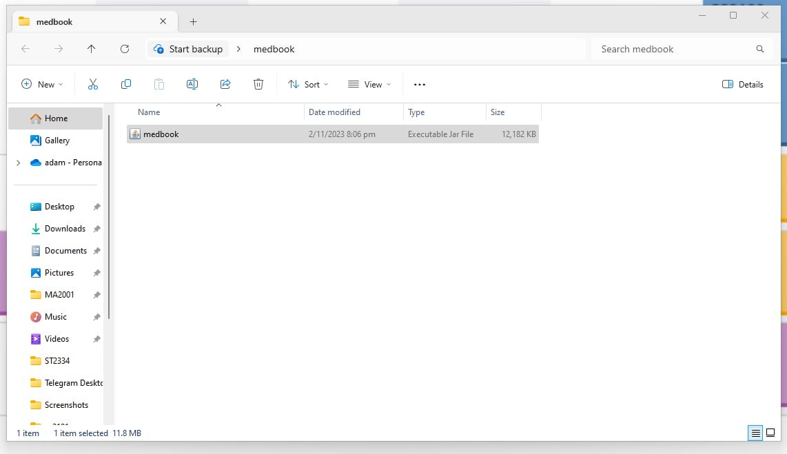
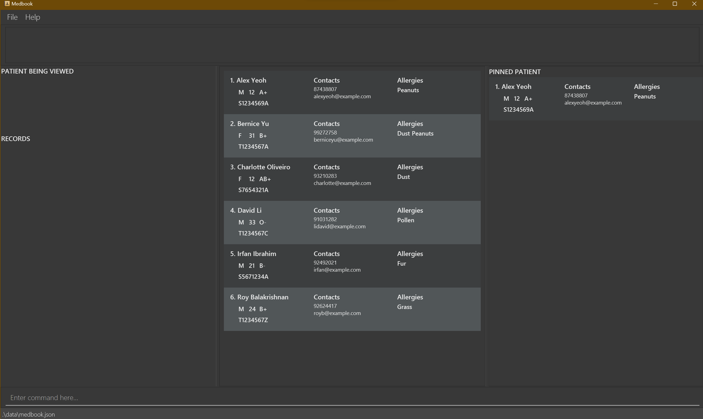
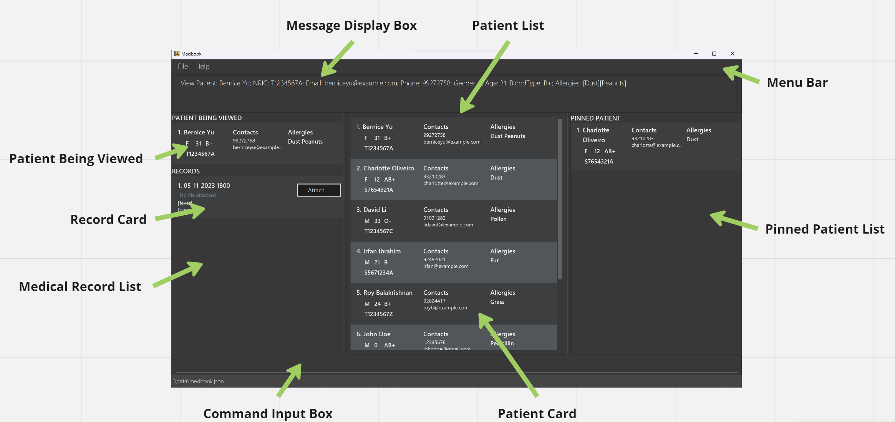
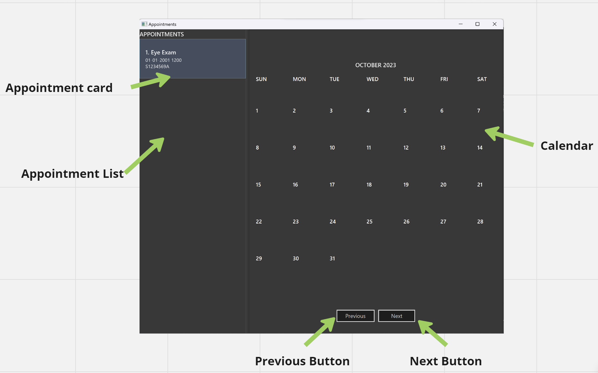
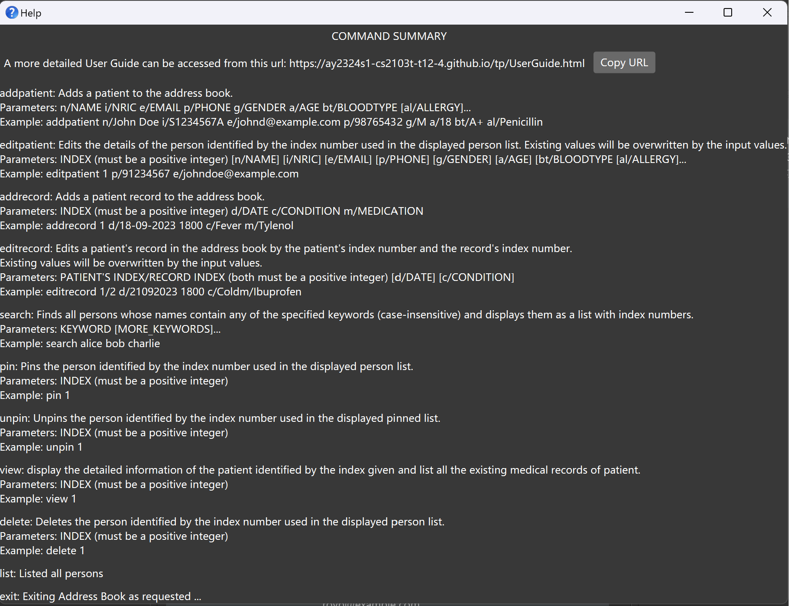
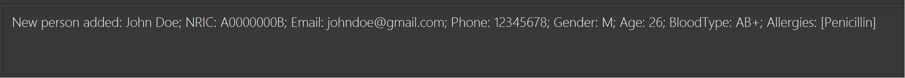
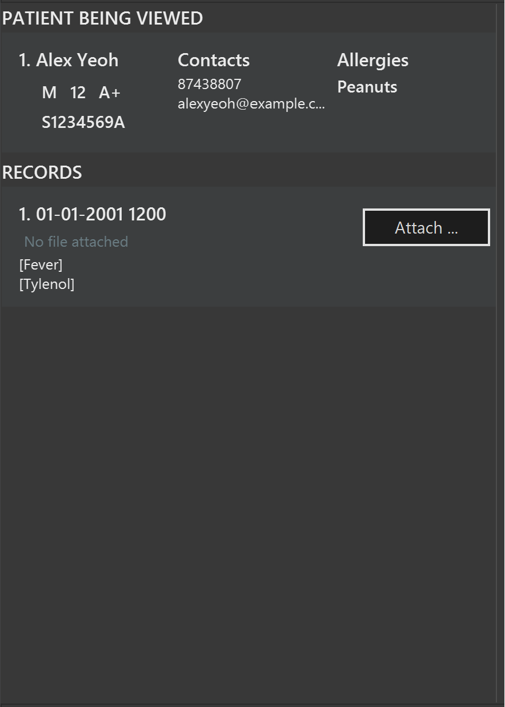

# User Guide

## Streamline Patient Management and Medical Records with Just a Few Taps!

Medbook is a **desktop application** crafted specifically for **doctors** and **medical administrative assistants** of private clinics to manage patient details and medical records.

Medbook provides a streamlined and user-friendly interface that empowers doctors and medical administrative assistants to effortlessly track patient details and medical records. This ensures that critical information is well-organized, easily accessible, and fully secure for your peace of mind.

Here's how Medbook can streamline your tasks:

- Quickly save, edit, and remove patient details.
- Effortlessly handle patient appointments and records.
- Search for specific information in a snap.
- Get a comprehensive view of patient data, medical records, and appointments at a glance.

Discover the power of Medbook:

- **Digitalize Your Clinic**: Effortlessly transition to a digital clinic with our user-friendly features.
- **Optimized for Speed**: Medbook offers both a Command Line Interface (CLI) and an intuitive Graphical User Interface, making it ideal for fast typists like you.
- **QuickStart**: New to Medbook? Click [here](#quick-start) to start your journey.

## Table of contents

<!-- * Table of Contents -->
<page-nav-print />

<<<<<<< HEAD
=======
---

>>>>>>> master
## How to Navigate the User Guide

Welcome to the Medbook User Guide! Our goal is to empower you with the knowledge and confidence to make the most of Medbook's features.

- **Effortless Navigation**: Use the table of contents for seamless navigation between sections.
- **Quick Start for New Users**: If you're new to Medbook, start with the [Quick Start](#quick-start) section to get up and running.
- **Explore Features**: For those who have already set up Medbook, dive into the [Features](#features) section to discover all that our application has to offer.

We're here to make your experience as user-friendly as possible. Let's get started!

<<<<<<< HEAD
<u>[Back to Top](#user-guide)</u>

## Quick start 
=======
## Quick start
>>>>>>> master

1. Ensure you have Java `11` or above installed in your Computer.
   - [How do I check my version of Java?](#faq)
1. Download the latest jar file (`medbook.jar`) from our [github release](https://github.com/AY2324S1-CS2103T-T12-4/tp/releases).

1. Move the jar file to the folder you want to store the data of the patients.

   - Create a folder with your preferred name (you can call it Medbook) where you would like to house the application.
   - Move the downloaded jar file to the folder as shown below.
     - For Mac users:
     - For Windows users:

1. Run Medbook application

   - **On Windows**:

     - Double-click medbook.jar to run the application.
     - If the GUI doesn't show up, try the following operations.
     - **Open PowerShell**: Search for "Powershell" in the Windows search bar and open it.
     - Navigate to the folder where you have stored the jar file using the cd command.
     - Enter java -jar medbook.jar and press Enter. This command will execute the application. 
       <box type="info" seamless>
       Please note that for Windows users, you can navigate to the folder where you house Medbook. In the file address bar, click on the path to the current folder to highlight it. Type powershell and press enter. This will open a PowerShell window with the current folder as the working directory.
       </box>

   - **On Mac**:
     - **Open Terminal**: You can find Terminal in the "Utilities" folder within the "Applications" folder. Or, you can use Spotlight Search by pressing Command + Spacebar and typing "Terminal."
     - Navigate to the folder where you have stored the jar file using the cd command
     - Run the Application: Enter java -jar medbook.jar and press Enter. This command will execute the application. 
       <box type="info" seamless>
       Please note that for Mac users, in the Terminal on a Mac, you can also drag and drop the "medbook.jar" file directly into the Terminal window after typing `java -jar` to auto-fill the file path.
       </box>

The application should open up similar to the image below.

1. Learn more about navigating the GUI [here](#navigating-the-graphical-user-interface-gui).
2. For new users, learn how to use Medbook [here](#medbook-tutorial).
3. For advanced users, view all the available features [here](#features).
    
<u>[Back to Top](#user-guide)</u>

## Glossary

### Definitions

Here are some description of the terms used throughout this user guide.

| **Term**      | **Definition**                                                                                                                                                                  |
| ------------- | ------------------------------------------------------------------------------------------------------------------------------------------------------------------------------- |
| Parameter     | A parameter allow you to customize the behavior of the command by providing specific values                                                                                     |
| Command       | A command is a textual input that users type into the command-line interface to communicate with the application                                                                |
| GUI           | GUI is graphical user interface. It manages the interaction between user and the application and also gives a visual display of Medbook.                                        |
| GUI component | GUI components are the interactive parts of the application that you can see and interact with. For more information of different GUI components. Please refer to below section |
| CLI           | CLI or Command Line Interface, is a text-based way to interact with the application.                                                                                            |

<u>[Back to Top](#user-guide)</u>

## Navigating the Graphical User Interface (GUI)

Here is a brief summary of GUI component of the main window of Medbook.

| **Name of component**    | **Description**                                                                                             |
| ------------------------ | ----------------------------------------------------------------------------------------------------------- |
| Menu Bar                 | Contains the help and file drop down menu for Medbook                                                       |
| Message Display Box      | Display the message of every command. Either can be an error message or success message                     |
| Patient List             | Contains all the Patient cards stored in Medbook                                                            |
| Patient Information card | Contains information of the Patient including age, blood type, gender, contact information and allergies    |
| Patient Being viewed     | Contains the patient card of currently being viewed patient                                                 |
| Medical Record List      | Contains all the Record card of the patient currently being viewed                                          |
| Record Card              | Contains information of the medical record including appointment date, condition, and prescribed medication |
| Pinned Patient List      | Contains all the patient cards after command pin                                                            |
| Command Input Box        | Allow users to input commands                                                                               |

| **Name of component** | **Description**                                                           |
| --------------------- | ------------------------------------------------------------------------- |
| Appointment Card      | Contains information of appointments including name, date and NRIC number |
| Appointment List      | Holds a list of Appointment card                                          |
| Calendar              | A calendar that displays appointments at certain date                     |
| Previous Button       | Shift the month shown in the calendar to previous month                   |
| Next Button           | Shift the month shown in the calendar to next month                       |

<u>[Back to Top](#user-guide)</u>

## Medbook Tutorial

1. Launch the Medbook application. You may refer to [here](#quick-start).

   - Note on launch, Medbook will populate some sample data.

2. Let us try invoking the help window. Type help in the command box and press Enter to execute it.
   Please refer to the first section of [feature](#features) to have a more clear understanding of requirements of the parameters.
   A similar help box as below should pop up.  
3. Now, let us try adding a new patient. In the command box, type in `addpatient n/John Doe e/johndoe@gmail.com p/12345678 g/M a/26 bt/AB+ al/Penicillin` and press Enter.
   A success message should be displayed. 
4. Try adding a few more patient to Medbook by yourself!
5. Now, let us try adding a record to a patient. In the command box, type in `addrecord 3 d/18-09-2023 1800 c/Fever m/Paracetamol` and press Enter.
   This will create a new medical record to the third patient shown in the middle column.
   A similar message output should be shown in the Message Display Box.  
6. Try adding a few more records to patients in the Medbook by yourself!
7. Let us view medical records of the first patient. Key in `view 1` to see all the records of the first patient.
   If you haven't added any medical records to the first patient, a similar **Record List** should be shown.
    

You may now have a basic understanding of this software. Try out the features in the following section on your own and explore the potential of Medbook!

<box type="info" seamless>
    Take a moment to review these notes on the command format, and it will help you navigate and use Medbook more smoothly!
</box>

<u>[Back to Top](#user-guide)</u>

---

## Features

<box type="info" seamless>

**Notes about the command format:** 

- Words in `UPPER_CASE` are the parameters to be supplied by the user. 
  e.g. in `add n/NAME`, `NAME` is a parameter which can be used as `add n/John Doe`.

- Items in square brackets are optional. 
  e.g `n/NAME [al/ALLERGIES]` can be used as `n/John Doe al/Pencillin` or as `n/John Doe`.

- Items with `…`​ after them can be used multiple times including zero times. 
  e.g. `[al/ALLERGIES]…​` can be used as ` ` (i.e. 0 times), `al/Pencillin`, `al/Pollen al/Dust` etc.

- Parameters can be in any order. 
  e.g. if the command specifies `n/NAME p/PHONE_NUMBER`, `p/PHONE_NUMBER n/NAME` is also acceptable.

- Extraneous parameters for commands that do not take in parameters (such as `help`, `list`, and `exit`) will be ignored. 
  e.g. if the command specifies `help 123`, it will be interpreted as `help`.

- **PATIENTID**: refers to the unique patient ID shown in the displayed patients list. The ID **must be a positive integer** 1, 2, 3, …​  

- **RECORDID**: refers to the unique record ID shown in the displayed **RECORDS** list of a specific patient. The ID **must be a positive integer** 1, 2, 3, …​  

- **APPOINTMENTID**: refers to the unique appointment ID shown in the displayed **APPOINTMENTS** list. The ID **must be a positive integer** 1, 2, 3, …​  

- **PINNEDID**: refers to the unique ID shown in the displayed **PINNED PATIENT** list. The ID **must be a positive integer** 1, 2, 3, …​  

</box>

### Parameters

| FIELD        | PREFIX | CONSTRAINTS                                                                                                   |
|--------------|--------|---------------------------------------------------------------------------------------------------------------|
| **NAME**     | n      | Up to 256 alphanumeric characters                                                                             |
| **NRIC**     | i      | Starts with a letter, followed by seven digits, and ends with another letter (letters are not case-sensitive) |
| **EMAIL**    | e      | Emails should be of the format local-part@domain                                                              |
| **GENDER**   | g      | Either **M** or **F**                                                                                         |
| **PHONE**    | p      | Must be at least 3 digits long                                                                                |
| **AGE**      | a      | Must be a non-negative integer                                                                                |
| **BLOODTYPE**| bt     | Must be one of **A-**, **A+**, **B-**, **B+**, **AB-**, **AB+**, **O-**, **O+**                               |
| **ALLERGY**  | al     | Up to 256 alphanumeric.                                                                                       |
| **DATE**     | d      | Must be in the form of 'dd-MM-yyyy HHmm'                                                                      |
| **CONDITION**| c      | Up to 256 alphanumeric characters                                                                             |
| **MEDICATION**| m     | Up to 256 alphanumeric characters                                                                             |

<box type="info" seamless>
 
**Notes for email format:**  

1. The **local-part** should only contain alphanumeric characters and these special characters, excluding the parentheses, (+_.-). The local-part may not start or end with any special characters.  

2. This is followed by a '@' and then a domain name. The domain name is made up of domain labels separated by periods.  

The **domain** name must:  

- end with a domain label at least 2 characters long  

- have each domain label start and end with alphanumeric characters  

- have each domain label consist of alphanumeric characters, separated only by hyphens, if any.

**Notes for allergy format:**  
- Multiple words for an allergy must be seperated with hyphen.
- Each word must be alphanumeric characters. 

</box>

<u>[Back to Top](#user-guide)</u>

### Viewing help : `help`

Shows a message explaining how to access the help page.

Format: `help`

<u>[Back to Top](#user-guide)</u>

### Adding a patient: `addpatient`

Adds a patient's contact and medical details.

Format: `addpatient n/NAME i/NRIC e/EMAIL p/PHONE g/GENDER a/AGE bt/BLOODTYPE [al/ALLERGY]...`

- Adds a patient with information including: **NAME**, **NRIC**, **EMAIL**, **GENDER**, **PHONE**, **AGE**, **BLOODTYPE**, **ALLERGY**.

Examples:

`addpatient n/John Doe i/T1234567A e/johndoe@gmail.com p/12345678 g/M a/26 bt/AB+ al/Penicillin`
Adds a **Male** patient named **John Doe** whose NRIC is **T1234567A** , **26** years old, has **AB+** Blood Type, and is allergic to **Penicillin**.
His email and phone number is **johndoe@gmail.com** and **12345678**, respectively.

<box type="info" seamless>
Info:
If the patient does not have an NRIC, eg. foreigners, a placeholder NRIC which is not valid such as `A1234567A` can be used.
</box>

<u>[Back to Top](#user-guide)</u>

### Adding Medical Records : `addrecord`

Adds a patient's medical record.

Format: `addrecord PATIENTID d/DATETIME c/CONDITIONS... m/MEDICATIONS...`

- Adds a medical record to the patient with the corresponding **PATIENTID**.  

- Constraints of each field are as stated in the **CONSTRAINTS** section above.  

- Duplicate entries for **CONDITIONS** and **MEDICATIONS** are allowed and will be considered as separate entries.
  * Therefore, `addrecord 1 d/10-11-2023 1800 c/Flu c/Flu m/Ibuprofen m/Ibuprofen` will store **[Flu, Flu]** and **[Ibuprofen, Ibuprofen]** for conditions and medications, respectively.

Examples:

- `addrecord 3 d/18-09-2023 1800 c/Fever m/Paracetamol`
  Adds a record to the patient with the **PATIENTID** of **3**.
  The record says that the patient visited the clinic on **September 18th, 2023** at **6PM** with a **Fever** and was prescribed **Paracetamol**.

<u>[Back to Top](#user-guide)</u>

### Adding an Appointment : `addappointment`

Adds an appointment.

Format: `addappointment PATIENTID n/NAME d/DATETIME`

- Adds an appointment to the patient with the corresponding **PATIENTID**.

-The appointment will then appear in the **APPOINTMENTS** list with patient's **NRIC**.  

- Constraints of each fied are as stated in the **CONSTRAINTS** section above.  

Examples:

- `addappointment 2 n/Eye Examination d/10-10-2023 1800` adds an **Eye Examination** to the **2nd patient** in the patients list. The appointment is set on **10th October 2023** at **6:00pm**.

<u>[Back to Top](#user-guide)</u>

### Listing all patients : `list`

Shows a list of all patients in the Medbook.

Format: `list`

- **All** patients in the Medbook will always be visible on the screen in the **Patient List**.

Examples:

- `list` lists all the patients in the **Patient List**.

<box type="info" seamless>
    The `list` command allows you to easily view all the patients in the Patient List. For instance, after you've used the `search` command to find specific patients using keywords, you can use the `list` command to gather all the patients conveniently! 
</box>

<u>[Back to Top](#user-guide)</u>

### View patient records : `view`

Displays the medical records of the specified patient in the **Medical Record List**.

Format: `view PATIENTID`

- The medical records of the patient with the corresponding `PATIENTID` will be displayed on screen in the **Medical Record List**.  

- Information about the patient will be displayed in the **PATIENT BEING VIEWED** section.  

Examples:

- `view 2` displays the medical records of the **2nd patient** in the patients list. The displayed records will be in the **RECORDS** list and patient information will be in the **PATIENT BEING VIEWED** section.

<box type="info" seamless>
    The PATIENT INDEX in the Patient Being Viewed section remains 1, if you wish to quickly operate on the patient, please use search to locate the patient with the patient's detail.
</box>

<u>[Back to Top](#user-guide)</u>

### View appointments : `viewappointment`

Displays all the medical appointments in a separate window.

Format: `viewappointment`

- The appointments of all the patients in the patients list will be displayed on a new window in the **Appointment List**.  

- The **description**, **date and time**, and **NRIC** of the patient involved in appointment will be displayed in the **Appointment List**.  

- The **description** of appointments will also appear on the calendar at the corresponding **date**.  
  **Note**: Only the **first two** appointments according to the **APPOINTMENTS** list will be displayed on the calendar per date.

<u>[Back to Top](#user-guide)</u>

### Editing details of a patient : `editpatient`

Edits the detail of an existing patient in MedBook.

Format: `editpatient PATIENTID PREFIX/NEWVALUE...`

- Edits the patient at the specified `PATIENTID`.  

- Acceptable fields : **name**, **email**, **phone**, **gender**, **age**, **bloodtype**, **allergy**.  
  **note**: NRIC can't be changed.

- Existing values in the respective fields will be updated to the **NEWVALUE** input.  

- Constraints of each field are as stated in the **CONSTRAINTS** section above.  

- Duplicate entries for **CONDITIONS** and **MEDICATIONS** will be considered as one entry

Examples:

- `editpatient 1 e/johndoe_updated@gmail.com` Edits the email address of the 1st person to be **johndoe_updated@gmail.com**.  

- `editpatient 2 p/92345678` Edits the name of the 2nd person to be **92345678**.  

- `editpatient 3 al/aspirin` Edits the allergy of the 3rd person to be **aspirin**.  

- `editpatient 2 p/92345678 al/aspirin` Edits the name and allergy of the 2nd person to be **92345678** and **aspirin** respectively.  

<u>[Back to Top](#user-guide)</u>

### Editing a record of a patient : `editrecord`

Edits a record of an existing patient in MedBook.

Format: `editrecord PATIENTID/RECORDID PREFIX/NEWVALUE...`

- Edits a record at the specific **RECORDID** of the patient at the specified **PATIENTID**.  

- Acceptable fields : **date** , **condition**, **medication**.  

- Existing values in the field will be updated to the **NEWVALUE** input.  

- Multiple entries of date fields are not allowed.  
  S
- Multiple entries of condition/medication fields are allowed to represent a new set of conditions.  
- Constraints of each field are as stated in the **CONSTRAINTS** section above.  

Examples:

- `editrecord 1/1 d/25-10-2023 1200` Edits the dateTime of the 1st record of the 1st patient to be **25-10-2023 1200**.  

- `editrecord 1/1 c/Headache c/Flu` Edits the conditions of the 1st record of the 1st patient to be **Headache, Flu**.  

- `editrecord 1/1 c/Headache m/Paracetamol` Edits the conditions and medications of the 1st of the 1st patient to be **Headache** and **Paracetamol** respectively.  

<u>[Back to Top](#user-guide)</u>

### Locating patients by keywords: `search`

Searches the patient with the corresponding **KEYWORD**

Format: `search KEYWORD...`

- The search is not case-sensitive. e.g **Penicillin** will match **penicillin**.  

- A patient's name and details will be searched.  
  **note**: This does not include searching through the details of records.

- Patients matching at least one keyword will be returned.  

- Patients with detail that are not exactly the same as the `KEYWORD` searched will not appear.  

Examples:

- `search Alex` returns a list of patients with **Alex** in their details.  

- `search Alex M` will return patients with **Alex** or **M** in their details.

<u>[Back to Top](#user-guide)</u>

### Locating records by keywords: `searchrecord`

Searches the records of the patient that the user is currently viewing with the corresponding **KEYWORD**

Format: `searchrecord KEYWORD...`

- The search is not case-sensitive. e.g **Penicillin** will match **penicillin**.  

- A record's details will be searched.  

- Records matching at least one **KEYWORD** will be returned.  

- Records with detail that are not exactly the same as the **KEYWORD** searched will not appear.  

- **IMPORTANT:** `view` command must precede `searchrecord` command. Otherwise `searchrecord` command would return 0 record.

Examples:

- `searchrecord Penicillin` returns a list of records with **Penicillin** in their details.  

- `searchrecord Fever Cough` will return records with **Fever** or **Cough** in their details.  

- `searchrecord 19-10-2023` will return records with date **19-10-2023** in their details.  

<u>[Back to Top](#user-guide)</u>

### Deleting a patient : `delete`

Deletes the specified patient.

Format: `delete PATIENTID`

- Deletes the patient at the specified **PATIENTID**.

Examples:

- `delete 2` deletes the **2nd patient** from the patients list.

<u>[Back to Top](#user-guide)</u>

### Deleting a record : `deleterecord`

Deletes the specified record of the patient.

Format: `deleterecord PATIENTID/RECORDID`

- Deletes the record at the specific **RECORDID** of the patient at the specified **PATIENTID**.

Examples:

- `deleterecord 2/1` deletes the **1st record** of the **2nd patient** in the patients list.

<u>[Back to Top](#user-guide)</u>

### Deleting an appointment : `deleteappointment`

Deletes an appointment from the **APPOINTMENTS** list.

Format: `deleteappointment APPOINTMENTID`

- Deletes the appointment at the specific **APPOINTMENTID** in the **APPOINTMENTS** list.

Examples:

- `deleteappointment 1` deletes the **1st appointment** in the **APPOINTMENTS** list.

<u>[Back to Top](#user-guide)</u>

### Pinning a Patient : `pin`

Pins the specified patient to the **PINNED PATIENT** list.

Format: `pin PATIENTID`

- The pinned patient will always be visible on screen in the **PINNED PATIENT** list.

Examples:

- `pin 2` pins the **2nd patient** in the patients list to the **PINNED PATIENT** list.

<u>[Back to Top](#user-guide)</u>

### Unpinning a Patient : `unpin`

Unpins the specified patient from the **PINNED PATIENT** list.

Format: `unpin PINNEDID`

- Removes the patient at the specified **PINNEDID** from the **PINNED PATIENT** list.

Examples:

- `unpin 2` unpins the **2nd patient** in the **PINNED PATIENT** list.

<u>[Back to Top](#user-guide)</u>

### Attaching files to a patient's record

Attach local files to a patient's record by clicking on the attached file button located within each record row.

<box type="warning" seamless>
Caution: Refrain from deleting/relocating the local file. If necessary, re-attach the new file after relocation/deletion.
</box>

<u>[Back to Top](#user-guide)</u>

### Exiting the program : `exit`

Exits the program.

Format: `exit`

<u>[Back to Top](#user-guide)</u>

### Saving the data

MedBook data is saved to the hard disk automatically after any command that changes the data. This ensures the safety of your data. When MedBook is restarted, the data is loaded back into the application automatically.

<u>[Back to Top](#user-guide)</u>

### Editing the data file

MedBook data is saved automatically as a JSON file located in [JAR file location]/data/medbook.json. The file can be edited directly to make changes to MedBook data.

<box type="warning" seamless>
Caution:
Only advanced users are encouraged to make changes to the data file as wrong data formatting may result in the application not working as intended.
</box>

<u>[Back to Top](#user-guide)</u>

---

## FAQ

**Q**: How do I check my java version? 
**A**: Open a command prompt and type `java -version`. If you do not have Java installed, you can download it [here](https://www.oracle.com/java/technologies/downloads/#java11).

**Q**: How do I transfer my data to another Computer? 
**A**: Install the app in the other computer and copy the data folder over to the same location in the other computer.

<u>[Back to Top](#user-guide)</u>

---

## Known issues

1. **When using multiple screens**, if you move the application to a secondary screen, and later switch to using only the primary screen, the GUI will open off-screen. The remedy is to delete the `preferences.json` file created by the application before running the application again.

<u>[Back to Top](#user-guide)</u>

---

## Command summary

| Action              | Format, Examples                                                                                                                       |
| ------------------- | -------------------------------------------------------------------------------------------------------------------------------------- |
| **Help**     | `help` |
| **Add Patient**     | `addpatient n/NAME i/NRIC e/EMAIL p/PHONE g/GENDER a/AGE bt/BLOODTYPE [al/ALLERGY]...​`   e.g., `addpatient n/John Doe i/T1234567A e/johndoe@gmail.com p/12345678 g/M a/26 bt/AB+ al/Penicillin` |
| **Add Record**      | `addrecord PATIENTID d/DATETIME c/CONDITION... m/MEDICATION...`  e.g., `addrecord 2 d/10-10-2020 1900 c/Fever m/Painkiller`       |
| **Add Appointment** | `addappointment PATIENTID n/APPOINTMENTNAME d/DATETIME`  e.g., `addappointment 2 n/Eye Exam d/10-10-2020 1900`                      |
| **List**            | `list`                                                                                                |
| **View Records**            | `view PATIENTID`  e.g., `view 2`                                                           |
| **View Appointments**            | `viewappointment`                                                                        |
| **Edit Patient** | `editpatient PATIENTID PREFIX/NEWVALUE...`  e.g.,`editpatient 1 e/johndoe_updated@gmail.com`           |
| **Edit Record**  | `editrecord PATIENTID/RECORDID PREFIX/NEWVALUE...`  e.g.,`editrecord 1/1 d/25-10-2023 1200`            |
| **Search Patients**          | `search KEYWORDS...`  e.g., `search James`                                           |
| **Search Records**          | `searchrecord KEYWORDS...`  e.g., `searchrecord Headache`                                  |
| **Delete Patient**          | `delete PATIENTID`  e.g., `delete 3`                                                       |
| **Delete Record**          | `deleterecord PATIENTID/RECORDID`  e.g., `delete 2/1`                                       |
| **Delete Appointment**          | `deleteappointment APPOINTMENTID`  e.g., `deleteappointment 1`                         |
| **Pin**             | `pin PATIENTID`  e.g., `pin 2`                                                                     |
| **Unpin**           | `unpin PINNEDID`  e.g. `unpin 2`                                                                  |
| **Exit**            | `exit`                                                                                                |

<u>[Back to Top](#user-guide)</u>
